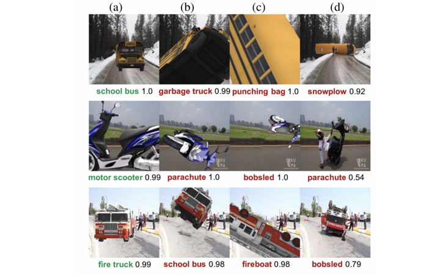
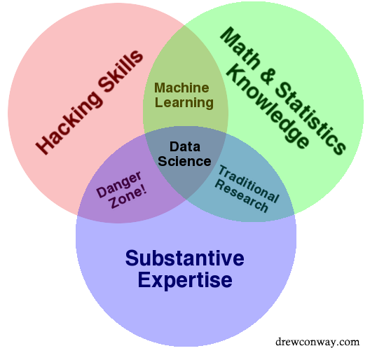

## Introduction

There are many buzz-words found in this discipline. Examples include: statistical inference, artificial intelligence, data science, machine learning, and deep learning.

Below is a list of terms and definitions:

<dl>
<dt>
  <b>Statistical Inference</b>
</dt>
<dd>
A form of inferential data analysis which works on probability distributions. Inferencing is performed with test hypotheses on population samples and properties are discovered. Two popular paradigms in this field are <strong>Frequentist</strong> and <strong>Bayesian inference</strong>.
</dd>
<dt>
  <strong>Data Science</strong>
</dt>
<dd>
A combination of many disciplines that work together to extract information from both structured and unsctructured data. Machine Learning is one possible tool.
</dd>
<dt>
  <strong>Artificial Intelligence</strong>
</dt>
<dd>
Intelligence demonstrated by machines that differs from natural intelligence demonstrated by humans. Popular sub-fields include robots and machine learning.
</dd>
<dt>
  <strong>Machine Learning</strong>
</dt>
<dd>
An approach of Artificial Intelligence that was defined in the 1950's by Arthur Samuel. In 1998 Tom Mitchell defined Machine learning programs in the following formula:

> "A computer program is said to learn from experience E,
> with respect to some task T and some performance P,
> if its performant on T, as measured by P,
> improves with experience E".

An example would be an e-mail spam classifier that is fed labelled training data (i.e. e-mail title="Buy viagra pills!", spam = true) and based on this training data it is able to accurately classify any inputs.
</dd>
<dt>
  <strong>Deep Learning</strong>
</dt>
<dd>
Extends machine learning by working on multiple layers that simplify and abstract features of the world to smaller and smaller variants. Deep learning is able to automatically perform feature extraction out of data sets compared to traditional machine learning which requires manual work from domain experts.
</dd>
</dl>

- [Introduction](#introduction)
- [Symbolic Reasoning](#symbolic-reasoning)
- [Artificial Neural Networks](#artificial-neural-networks)
  - [Machine Learning](#machine-learning)
  - [Backpropagation](#backpropagation)
  - [Deep Learning](#deep-learning)
  - [Training Neural Networks](#training-neural-networks)
  - [Back-Propagation phase](#back-propagation-phase)
  - [Vectorization](#vectorization)
  - [Activation Function](#activation-function)
  - [Inference](#inference)
- [Associated Roles](#associated-roles)
- [Algorithms](#algorithms)
- [Reasoning](#reasoning)
- [Algorithms and Approaches](#algorithms-and-approaches)
- [Series](#series)

## Symbolic Reasoning

Symbolic reasoning - known as Good Old Fashioned AI - is a combination of rules, formal logic, and human knowledge to perform deductive reasoning.

Although the AI industry moved away from symbolic reasoning to neural networks, GenAI skeptics like Gary Marcus suggest that [symbolic reasoning is still necessary in AI](https://nautil.us/why-robot-brains-need-symbols-237267). His example of an AI confusing a yellow school bus with a yellow snow plow provides concern when we have self-driving cars on our roads. His provides a solution which is to combine symbolic reasoning with AI - Neuro-Symbolic AI.

<figure>

<figcaption>Figure: AI mistaking a school bus image with a snow plow. From: <a href="https://nautil.us/why-robot-brains-need-symbols-237267">Nautilus</a>.</figcaption></figure>

## Artificial Neural Networks

The AI industry has moved toward neural networks over alternatives such as symbolic reasoning.

Neural Networks have two development phases:

1. **Training** the neural network:
   1. Supervised learning with training data using **backpropagation**.
   2. Unsupervised learning
2. **Inference** in production use

### Machine Learning

Machine learning is a method where computers can "learn" from data without defined rules using a model and training data.

### Backpropagation

In 1986 Rumelhart discovered <a href="https://www.nature.com/articles/323533a0?foxtrotcallback=true">back-propagation </a>- a method that allowed neural networks to solve complex non-linear problems.

- <a href="https://www.mladdict.com/neural-network-simulator">Back-propagation demo</a>
- <a href="http://iamtrask.github.io/2015/07/12/basic-python-network/">Back-propagation</a>
- <a href="https://stackoverflow.com/questions/2480650/role-of-bias-in-neural-networks">Bias neurons</a>
- <a href="https://www.youtube.com/watch?v=i94OvYb6noo">Back-propagation lecture</a>
- <a href="http://www.benfrederickson.com/numerical-optimization/">Back-propagation visualization</a>
- <a href="http://neuralnetworksanddeeplearning.com/chap2.html">Back-propagation chapter</a>

### Deep Learning

In 1986 Dechter discovered <a href="http://www.aaai.org/Papers/AAAI/1986/AAAI86-029.pdf">deep learning</a>. Deep Learning is a branch of machine learning that uses multi-layers to identify complex data patterns and learn hierarchical features automatically from raw data such as images, text, or audio.

## Associated Roles

- Data scientist = usually a M.Bsc. or PhD researcher who can create a model in MATLAB.
- Data engineer
- Machine learning engineer

<figure>

<figcaption>

[Fig. Drew Conway The Data Science Venn Diagram](http://drewconway.com/zia/2013/3/26/the-data-science-venn-diagram)
</figcaption>
</figure>

## Algorithms

- **Classification** = output a discrete value
- **Regression** = output a continuous value
- **Clustering** = organize and divide data
- **Density estimation** = outputs the distribution in an input space
- **Dimensionality reduction** = maps inputs into a lower dimensional space

Follow the "<a href="http://scikit-learn.org/stable/tutorial/machine_learning_map/">Choosing the Right Estimator</a>" decision graph hosted by Sci-Kit to find an algorithm to solve your problem.

## Machine Learning Reasoning

How to reason about the machine learning error graph?

- If you have an underfit model, add more training cases/features
- If you have an overfit model, reduce the number of features by performing Lasso/L1 or Ridge/L2 regression
- If you have a linear model, use classifiers, linear regression, or SVM's
- If you have a non-linear model, use neural networks
- If you have a small amount of data and a large feature set, use a kernel SVM

## Algorithms and Approaches

- Supervised Learning: train with data.
- Unsupervised Learning
- Deep Learning: an advanced form of machine learning where models have a large number of hidden layers.

## Series

- [Before Artificial Intelligence](/a-history-of-artificial-intelligence)
