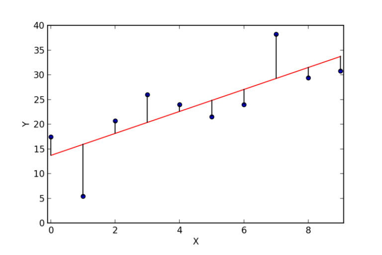

## Legendre's Method of Least Squares

The first concept used in Neural Networks is Adrien-Marie Legendre's invention for calculating the trajectory of comets: <a href="http://web.archive.org/web/20171011063921/http://www.stat.ucla.edu/history/legendre.pdf">Method of Least Squares</a>. The goal is to find values that when substituted for the variables of a function it would minimize/maximize the output. This method can be used as a cost function in machine learning.

Steps:
1. Graph the data points (i.e. comet position).
2. Graph a function (for example, a line: $y=x$).
3. Calculate the difference between data points and the line (called **residuals**).
4. Calculate the **Residual Sum of Squares** to find the total error.
5. Repeat Step 1 with a new function with the goal of finding the least error function.

Diagram:
<figure>

<figcaption>Legendre's method  of least squares. Residuals are shown.</figcaption>
</figure>

Equation:
$$
\frac{1}{N} \sum_{i=1}^{N}{(y_i - (m*x_i + b))^2}
$$

Equation pseudocode in Typescript:

```ts
function leastSquare(f: Function, coordinates: Array<Array<number>>) {
  let total = 0
  for (const [x, y] of coordinates) {
    total += Math.pow(y - f(x), 2)
  }
  return total / coordinates.length
}
//Call 1:
leastSquare(x => 1*x + 2, [ [1,1], [2,4], [3,9] ]);
//Error 1: (4+0+16)/3=6.66
//Call 2:
leastSquare(x => x**2, [ [1,1], [2,4], [3,9] ]);
//Error 2: 0+0+0=0
```

Limitations:
- Find a function that best fits the data points (i.e. line, parabola, cubic, etc.)
- Find the function's coefficients that best fits the data points
- When to halt the process? Which error is sufficient?

### Debye's Gradient Descent

Legendre's Method of Least Squares is too error-prone and labor-intensive. Peter Debye improved Legendre's manual solution with mathematical derivatives. This method lowers the error but is prone to stopping on a small error value instead of search for the smallest error value. (Note that this method works well with concave functions that converge on a global minima)

Steps:
1. Define an error function:
$$f(x) = x^3 + x^2 + x$$
2. Find its derivative:
$$\frac{\partial f(x)}{\partial x} = 3x^2 + 2x + 1$$
3. Run the gradient descent function with the above as inputs.

Pseudo-code in Typescript:

```js
function gradientDescent(epochs: number, alpha: number, errorDerivative: Function) {
  let prevX = 0
  let x = 0
  let epoch = 0
  while (epoch < epochs && prevX >= x) {
    prevX = x
    x += -alpha * errorDerivative(prevX)
    epoch += 1
  }
  return x
}
gradientDescent(10, 0.01, )
```

### Linear Regression

In the 1950's computer scientists combined Method of Least Squares and Gradient Descent to produce Linear Regression.

### Perceptron

Frank Rosenblatt invented the <a href="http://citeseerx.ist.psu.edu/viewdoc/download?doi=10.1.1.335.3398&rep=rep1&type=pdf">perceptron</a> in 1958 to mimick a neuron. In 1969 Minsky & Papert found out that perceptrons <a href="https://mitpress.mit.edu/books/perceptrons">could only solve linear problems </a>and that non-linear problems such as XOR were impossible. In the 1970's Linnainmaa proved multi-layered perceptrons <a href="http://people.idsia.ch/~juergen/linnainmaa1970thesis.pdf">could solve non-linear functions</a>.
