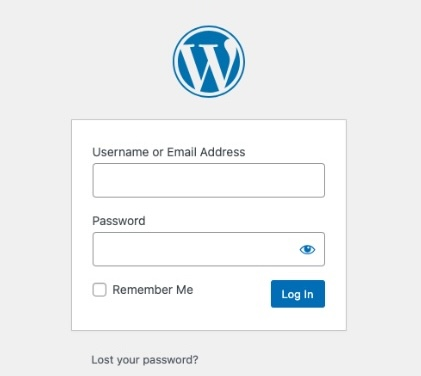

## Introduction

This post deep dives on securing software going from the traditional one login per website to federated identity:

- Authentication versus Authorization
- Distinguish technical jargon: Auth-N/Z, OAuth, OIDC, IdP, SSO, STS, etc.
- Secure an e-commerce platform
- Secure a timesheet tracker microservice application
- Secure a multi-tenant B2B application

### TL;DR

- [Introduction](#introduction)
  - [TL;DR](#tldr)
- [The Traditional Account Management Website](#the-traditional-account-management-website)
  - [Pain Points](#pain-points)
- [Concepts](#concepts)
  - [Authentication (Auth-N)](#authentication-auth-n)
    - [Identity and Access Management (IAM)/Authentication System](#identity-and-access-management-iamauthentication-system)
  - [Authorization (Auth-Z)](#authorization-auth-z)
    - [Access Control Lists (ACL)](#access-control-lists-acl)
    - [Role-based Access Control (RBAC)](#role-based-access-control-rbac)
      - [Logic](#logic)
      - [API Authorization Example](#api-authorization-example)
    - [Attribute-based Access Control (ABAC)](#attribute-based-access-control-abac)
      - [API Authorization Example](#api-authorization-example-1)
- [Modern Security](#modern-security)
  - [OAuth 2.0](#oauth-20)
    - [Roles](#roles)
- [Security Token Service](#security-token-service)
- [Identity Provider (IdP)](#identity-provider-idp)
- [OpenID Connect](#openid-connect)
- [Federated Identity](#federated-identity)
- [Future stories](#future-stories)
- [References](#references)

## The Traditional Account Management Website

<figure>

  
  <figcaption>Fig. Wordpress Admin login page</figcaption>
</figure>

The traditional approach is to have every company reimplement account management with the following **features**:

1. **Account Lifecycle Management**
   1. User registration
   2. Password reset
   3. Locking accounts
2. **Authentication**
   1. User login
   2. Multi-factor Authentication (MFA)
3. **Authorization**
   1. Access Control through AD

### Pain Points

For the user:
  - Increased attack vector as multiple companies have to be trusted to properly secure logins
  - Hassle. Remember multiple passwords

For the company:
  - Reinvent the Wheel(tm) for all of the above features.
  - Spend money/energy maintaining software.

Is there a better solution? Below is a list of nice-to-haves:
- Centralize account lifecycle management
- Federate identity across multiple companies
- Multi-tenant for B2B solutions

## Concepts

Before we dive deeper a couple of security concepts have to be understood:

1. Authentication
2. Authorization
3. 

### Authentication (Auth-N)

Authentication is "**Who**" the user is.

Examples:

- A driver's license that states name, date of birth, and address

Two common methods of proving who you are include:

1. Logins
2. Tokens

#### Identity and Access Management (IAM)/Authentication System

A website that has the same features as a Traditional Account Management System usually including the following features:

- Host Login/Registration/Forgot Password pages
- Store user account information

### Authorization (Auth-Z)

Authorization is "**What**" the user has access to.

Examples:

- A corporate ID key fob that gives access to a building

Three common implementions of authorization include:

- Access Control Lists (ACL)
- Role-Based Access Control (RBAC)
- Attribute-Based Access Control (ABAC)

#### Access Control Lists (ACL)

Access Control Lists assign permissions directly to users/groups.

Examples:

- Cloud:
  - AWS Network ACL (NACLs) and MS Azure Network Security Groups (NSGs) for traffic access
- OS File Systems:
  - Windows NTFS ACL and Linux POSIX ACL for user/group file/folder access
  [](https://documentation.suse.com/sles/15-SP7/html/SLES-all/cha-security-acls.html)
- OS Network Firewalls:
  - Windows Firewall and Linux IPTables for network access
  [](https://www.cherryservers.com/blog/how-to-manage-linux-system-routing-rules-with-iptables)

#### Role-based Access Control (RBAC)

Role-based authorization uses a static hierarchy based on real social hierarchies to enforce access control.

This makes management easier. Consider the scenario of a Engineer being promoted to a manager:
- Other Access Control methods (i.e. ACL, ABAC) would require the system administrator to manually update the user's permissions:
  ```diff
  Manage Repos
  Submit Time
  +Manage Direct Reports
  +Manage Timesheets
  ```
- RBAC would require the system administrator to simply swap the user's role from "Engineer" to "Project Manager"
  ```diff
  -Engineer(permissions: Manage Repos, Submit Time)
  +Project Manager(permissions: Manage Repos, Submit Time, Manage Timesheets, Manage Direct Reports)
  ```

##### Logic

The standard logic is to check if a user has a given role (i.e. _user in Project Managers_):

Logc:

$$
\exist r \space \text{s.t.} \space r \in \{ \text{User Roles} \} \land r \in \{ \text{Required Roles} \}
$$

Below is the accompanying SQL:

```sql
SELECT
    DISTINCT 1
FROM
    user_role ur
LEFT JOIN
    role r ON ur.role_id = r.role_id
WHERE
    ur.user_id = 1 AND
    r.role_code = 'PROJECT_MANAGER'
```
Fig. SQL to verify a user has a given role.

**An alternative** is to check if a user has a given permission (i.e. _readProjectReports in User Role Permissions_):

Logic:

$$
\exist p \space \text{s.t.} \space p \in \{ \text{User Role permissions} \}
$$

Below is the accompanying SQL:

```sql
SELECT 
    r.role_id,
    r.role_name,
    p.permission_id,
    p.permission_name
FROM
    role r
LEFT JOIN
    role_permission rp ON r.role_id = rp.role_id
LEFT JOIN
    permission p ON rp.permission_id = p.permission_id
WHERE
    r.role_id IN (1, 2, 3)
ORDER BY
    r.role_name, p.permission_name
```
Fig. SQL to retrieve the role/permissions for a given user's roles.

##### API Authorization Example

**Scenario**: a user is trying to access Project Reports.

Below is a Fastify/Fastify Guard code exampe:

```sh
import Fastify from 'fastify'
import fastifyGuard from 'fastify-guard'

const fastify = Fastify()
fastify.register(fastifyGuard, {
  errorHandler: (result, req, reply) => reply.status(403).send({ error: 'Unauthorized access' })
})

fastify.get('/project-reports', {
  preHandler: [fastify.guard.role('Project Manager', 'Project Director')]
}, (req, reply) => {
  //REDACTED
})
```

Below is a table showing permutations of user roles with the resulting authorization:

Roles | Authorized?
-|-
{Engineer} | false
{**Project Manager**} | **true**
{**Project Director**} | **true**
{Engineer, **Project Manager**} | **true**
{**Project Manager**, **Project Director**} | **true**

#### Attribute-based Access Control (ABAC)

Attribute-based authorization uses a list of dynamic attributes and policies to enforce access control.

##### API Authorization Example

**Scenario**: a user is trying to access a "beer" web page (🍺) in a "bar" web site.

The authorization logic is as follows (either/or):
- **Age=17**
- **Accompanied By Parents=True**

Below is a Fastify/Fastify JWT code example:

```ts
import Fastify from 'fastify'
import fastifyJwt from '@fastify/jwt'

const fastify = Fastify({ logger: true })
fastify.register(fastifyJwt, {
  secret: 'REDACTED',
})

function requireAdultOrWithParents() {
  return async function (request: any, reply: any) {
    try {
      await request.jwtVerify()
      
      const { age, accompaniedByParents } = request.user // Assumption: JWT claims have dynamically calculated age/accompaniedByParents using the OpenID ASC transformations feature

      if (age >= 18 || accompaniedByParents === true) {
        return
      }

      reply.status(403).send({
        error: 'Unauthorized',
        message: 'Adult or parent supervision required.',
      })
    } catch (err) {
      reply.status(401).send({
        error: 'Unauthorized',
        message: 'Invalid token',
      })
    }
  }
}

fastify.get(
  '/beer',
  { preHandler: [requireAdultOrWithParents()] },
  async (request, reply) => {
    //...
  }
)
```

**Result**: the user fails the first check but passes the second.

A more comprehensive table of claims and authorizations follows:

Age | Accompanied By Parents | Authorized?
-|-|-
17 | false | false
**18** | false | **true**
17 | **true** | **true**
**18** | **true** | **true**

## Modern Security

The traditional account lifecycle management approach is a bad design since every company has to reinvent the wheel and users have to juggle through forgot password screens and security breaches.

An improved design is to reduce the amount of login pages that the user has to access as well as share logins for multiple company websites.

New concepts are added:

- OAuth 2.0 protocol: an Authorization Server (STS) to delegate authorization to a separate website from the protected servers that users want to access.
- OpenID Connect protocol: an Identity Provider (IdP/STS) that proves the user identity to protected servers that users want to access.
- Identity and Access Management: a website that provides account lifecycle management features and is used by the Identity Provider for its login page.

### OAuth 2.0

OAuth 2.0 is a protocol for authorization which is commonly used in mobile and web development.

#### Roles

1. Resource Owner: you
2. Authorization Server: handles authorization
3. Resource Server: the server that you want to access

A simplified OAuth 2.0 workflow is as follows:

1. User tries to access a protected resource from a website and is redirected to a login page
2. The user is redirected to the previous page with an ID token
3. The website uses the ID token to return an access token
4. The website attempts to reacquire the protected resource with the access token

OAuth 2.0 provides authorization flows to be used by use case:

- Both confidential and public clients (i.e. mobile and web) can use the **Authorization Code Grant** to exchange authorization codes for access tokens. It is recommended to use an extension called **PKCE** for further security.
- Background processes and website API's can use the **Client Credentials Grant** type to obtain an access token outside of the context of a user.
- Browserless or input-constrained devices can use the **Device Authorization Grant** to exchange a previously obtained device code for an acces token.

## Security Token Service

A generic term for a server that issues security tokens.

Examples are:

- OAuth 2.0 Authorization Server which issues an `access_token`
- OpenID Connect Identity Provider (IdP) which issues as `id_token`

## Identity Provider (IdP)

An OAuth 2.0 Authorization Server that supports the OpenID Connect protocol that proves who the user identity is.

## OpenID Connect

OpenID Connect is a superset on OAuth 2.0 that brings user profile information.

It provides two tokens to applications:

- `id_token` for authentication purposes
- `access_token` for authorizing API requests

## Federated Identity

This is a system that allows users to access applications/domains across different organizations using only one login.

It allows you to build a website and use Facebook/Google/Microsoft login pages as an authentication provider. This reduces the burden of users remember a dozen of passwords and simplifies account management for them.

The concepts have a mapping between the above section:

OAuth 2.0/OpenID Connect | Federated Identity
-|-
OAuth 2.0 Authorization Server (with OpenID Connect) | Identity Provider
OAuth 2.0 Resource Server | Service Provider

## Future stories

1. Securing the user accounts of an e-commerce web portal
2. Securing the user accounts in a microservice architecture
3. Securing multi-tenant B2C web applications
4. SSO

## References

- https://oauth2simplified.com/ and its subsequent post by the author: https://aaronparecki.com/oauth-2-simplified/
- https://oauth.net/2/
- https://www.digitalocean.com/community/tutorials/an-introduction-to-oauth-2
- https://developers.google.com/oauthplayground/
